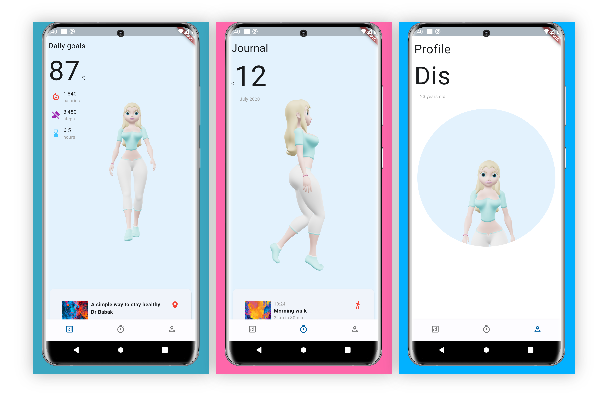

# 3D-UI

A new Flutter Design UI project, with 3d effects.


# Package Used 

- [o3d](https://pub.dev/packages/o3d)  -> to use 3d file 


# Website used

- [Vectary](https://www.vectary.com/)


# ScreenShots




# Video 


https://github.com/HusseinElbhrawy/3D-UI/assets/64389727/a141e037-fa85-45fe-b0b6-ba55c4132ec3


# How to use


```dart
flutter pub get
```

```dart
flutter run
```
